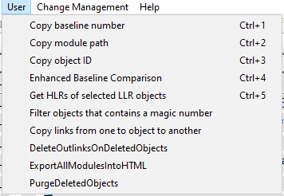
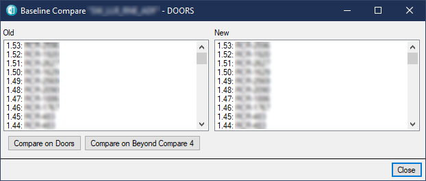
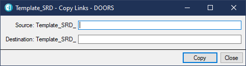

[](https://www.gnu.org/licenses/gpl-3.0)
[](https://www.gnu.org/licenses/gpl-3.0)

# DOORS-DXL-Scripts

A collection of useful DOORS DXL scripts that are independent of any specific project.



## How to install

- Download all files inside of this repo.
- Copy all files into your Doors installation folder ```C:\Program Files (x86)\IBM\Rational\DOORS\9.5\lib\dxl\addins\user```

Scripts listed in `user.idx` appear in the **User** menu of a module window. The other scripts are not in the menu; open them in the DXL editor (**Tools → Edit DXL...**), load the file and run it.

## Overview

| Script | File | User menu | Shortcut |
| --- | --- | :---: | :---: |
| [Copy Baseline Number](#copy-baseline-number-ctrl--1) | `CopyBaselineNumber.dxl` | ✓ | Ctrl + 1 |
| [Copy Module Path](#copy-module-path-ctrl--2) | `CopyModulePath.dxl` | ✓ | Ctrl + 2 |
| [Copy Object ID](#copy-object-id-ctrl--3) | `CopyObjectID.dxl` | ✓ | Ctrl + 3 |
| [Enhanced Baseline Comparison](#enhanced-baseline-comparison-ctrl--4) | `CompareBaselines.dxl` | ✓ | Ctrl + 4 |
| [Get HLRs](#get-hlrs-ctrl--5) | `GetHLRs.dxl` | ✓ | Ctrl + 5 |
| [Filter Magic Numbers](#filter-magic-numbers) | `FilterMagicNumbers.dxl` | ✓ | |
| [Copy Links](#copy-links) | `CopyLinks.dxl` | ✓ | |
| [Print Baselines and CRs](#print-baselines-and-crs) | `PrintBaselineAndCRs.dxl` | | |
| [Export All Modules into HTML](#export-all-modules-into-html) | `ExportAllModulesIntoHTML.dxl` | | |
| [Export to JSON](#export-to-json) | `ExportToJSON.dxl` | | |
| [Check Safety Related Tag](#check-safety-related-tag) | `CheckSafetyRelatedTag.dxl` | | |
| [List Derived Requirements](#list-derived-requirements) | `ListDerivedReqs.dxl` | | |
| [List Safety Requirements](#list-safety-requirements) | `ListSafetyReqs.dxl` | | |
| [Module Stats](#module-stats) | `ModuleStats.dxl` | | |
| [Delete Outlinks on Deleted Objects](#delete-outlinks-on-deleted-objects) | `DeleteOutlinksOnDeletedObjects.dxl` | | |
| [Purge Deleted Objects](#purge-deleted-objects) | `PurgeDeletedObjects.dxl` | | |

## Scripts

### Clipboard helpers

#### Copy Baseline Number (Ctrl + 1)

It copies the last baseline number ```Doors baseline X.X``` into the clipboard.

#### Copy Module Path (Ctrl + 2)

It copies the full path of the current module to the clipboard.

#### Copy Object ID (Ctrl + 3)

It copies the ID of the selected object(s) into the clipboard. If multiple objects are selected, they are separated by a newline.

#### Get HLRs (Ctrl + 5)

Select a range of LLR objects and run the script. It follows the outlinks of the selected objects to modules whose name contains `HLR_` and copies a comma-separated list to the clipboard: the IDs of the selected objects followed by the IDs of their linked HLRs. Linked HLR modules are opened read-only when needed.

### Baselines

#### Enhanced Baseline Comparison (Ctrl + 4)

This script shows baseline comparison windows similar to DOORS's windows with an extra button for Beyond Compare. It creates a .txt export of selected baselines in the background and then compares them with Beyond Compare. It's easier to see the difference with this method.

Beyond Compare 4 or 5 is expected at its default installation path (```C:\Program Files\Beyond Compare 4\BCompare.exe``` or ```C:\Program Files\Beyond Compare 5\BCompare.exe```).



#### Print Baselines and CRs

It prints every baseline of the current module with its CR number. The CR number is taken from the baseline suffix, or from the baseline annotation if the suffix is empty.

```
1.0: CR-123
1.1: CR-145
```

### Export

#### Export All Modules into HTML

It exports every formal module in the current folder, its subfolders and sub-projects to a fancy-styled, useful HTML report. The report is written to ```%USERPROFILE%\Desktop\DoorsExport```, in a directory tree that mirrors the DOORS folders. A directory is only created when a module in it is exported.

- **View:** if a module has a view named `Export`, that view (and its columns) is used. Otherwise, the module's default view is used. Layout DXL columns are evaluated for every object, so a dedicated `Export` view without them makes the export much faster. A module that is open in a window keeps its current view.
- **Bullets:** bullets of lists in rich text are written as a Unicode bullet character (•) instead of the `bullet.gif` image, so no image file is needed next to the exported HTML.
- **Pictures:** pictures larger than 600×400 px are shown smaller in the table, keeping their proportions. Clicking one shows it enlarged on the same page; a click anywhere or the Esc key closes it. The limits are `IMAGE_MAX_WIDTH` and `IMAGE_MAX_HEIGHT` at the top of the script.
- **Progress:** when run interactively, a progress window shows the current module and has a **Cancel** button. After a cancel, the export stops within 100 objects, and the HTML file of the module being exported is left incomplete.
- **Errors:** problems (a folder that cannot be created, a picture that cannot be exported, ...) are printed to the DXL output as `ERROR:` lines instead of dialog boxes, so a batch run never waits for a click.
- **Memory:** linked modules stay open between modules so they are not loaded again. They are closed when DOORS uses more than 1000 MB (DOORS's `MEM_LEVEL_CLOSE` environment variable changes this limit) and at the end of the export.

The following batch command can be used with **Task Scheduler** to periodically export modules.

```"C:\Program Files (x86)\IBM\Rational\DOORS\9.5\bin\doors.exe" -u "USERNAME" -P "PASSWORD" -p "PROJECT_NAME" -b "addins\user\ExportAllModulesIntoHTML.dxl" -W```

HTML reports can be served using Python's simple HTTP server command: ```python -m http.server 1111```.

#### Export to JSON

It exports the current module to a UTF-8 JSON file. A dialog asks for the destination file. Each object becomes one entry in a JSON array:

```json
{
  "Req ID": "MOD_123",
  "heading": "",
  "text": "The system shall ...",
  "level": 3,
  "Means Of Verification": "Test",
  "Safety Requirement": "False"
}
```

### Requirement checks

These scripts only read data and print their results to the DXL output window.

#### Check Safety Related Tag

It checks the `Safety Requirement` attribute of each requirement in the current module against its upper requirements. Objects whose `Req` attribute is `N` or empty are skipped. For every other object, it follows the outlinks to modules whose name contains `PIDS` or `ICD` and reads their `Safety Related` attribute. It reports:

- requirements marked as not safety but linked to a safety related PIDS/ICD object,
- requirements marked as safety but not linked to any safety related PIDS/ICD object,
- requirements without any PIDS/ICD link.

#### List Derived Requirements

It scans all formal modules in the current folder and its subfolders, and prints the ID of every object whose `Req` attribute is `D` (derived). Modules without a `Req` attribute are skipped.

#### List Safety Requirements

It scans all formal modules in the current folder and its subfolders, and prints the ID of every object whose `Safety Requirement` attribute is `True`. Modules without a `Safety Requirement` attribute are skipped.

#### Filter Magic Numbers

All numbers (except 0 and 1) not located inside of square brackets ```[]``` are assumed to be magic numbers. This script filters the objects that contain them.

#### Module Stats

It prints the heading structure of the current module: level 1 headings, and level 2 headings with the number of objects below them.

### Link and object maintenance

> **Warning:** These scripts modify module data. Create a baseline before running them.

#### Copy Links



It copies the outlinks from the source object to the destination object. The folder containing the linked modules should be open.

#### Delete Outlinks on Deleted Objects

It opens the current module in edit mode and deletes all outlinks of the soft-deleted objects.

#### Purge Deleted Objects

It finds the soft-deleted objects in the current module (including their children), undeletes them, clears their heading, replaces their text with `deleted` and then deletes them permanently. Purged objects cannot be recovered with undelete.

The line that opens the module in edit mode is commented out to prevent accidental runs. Open the module in exclusive edit mode yourself, or uncomment that line, before running the script.

## Documentation

The [docs](docs) folder contains the DXL reference manual (`dxl_reference_manual.pdf`, `dxl.chm`) and a list of all DXL commands (`AllCommands.dxl`).

## License

This project is licensed under the terms of the  [GNU General Public License v3.0](https://choosealicense.com/licenses/gpl-3.0/)

Copyright © 2020 M. Serdar Karaman
