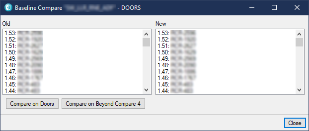
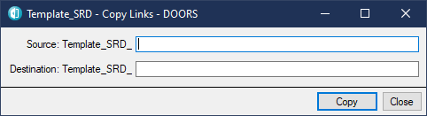

[](https://www.gnu.org/licenses/gpl-3.0)
[](https://www.gnu.org/licenses/gpl-3.0)

# DOORS-DXL-Scripts

A collection of useful DOORS DXL scripts that are independent of any specific project.


## How to install

- Download all files inside of this repo.
- Copy all files into your Doors installation folder ```C:\Program Files (x86)\IBM\Rational\DOORS\9.5\lib\dxl\addins\user```

## Scripts

### Copy Baseline number (Ctrl + 1)

Its copies the last baseline number ```Doors baseline X.X``` into the clipboard.

### Copy Module Path (Ctrl + 2)

It copies the full path of the current module to the clipboard.

### Copy Object ID (Ctrl + 3)

It copies Id of the selected object(s) into the clipboard. If multiple objects are selected they are will be separated by a newline.

### Enhanced Baseline Comparison (Ctrl + 3)

This script shows baseline comparison windows similar to DOORS's windows with an extra button for Beyond Compare. It creates a .txt export of selected baselines in the background and then compares them with Beyond Compare. It's easier to see the difference with this method.  



### Filter Magic Numbers

All numbers (except 0 and 1) not located inside of square brackets ```[]``` assumed magic number. This script filters them. `

### Copy Links



It copies the links from the source object to the destination object.

### Export all modules into HTML

These scripts recursively export all items under the project to a folder as a fancy-styled useful HTML report.

The following batch command can be used with **Task Scheduler** to periodically export modules.

```"C:\Program Files (x86)\IBM\Rational\DOORS\9.5\bin\doors.exe" -u "USERNAME" -P "PASSWORD" -p "PROJECT_NAME" -b "addins\user\ExportAllModulesIntoHTML.dxl" -W```

HTML reports can be served using Python's simple HTTP server command: ```python -m http.server 1111```.

## License

This project is licensed under the terms of the  [GNU General Public License v3.0](https://choosealicense.com/licenses/gpl-3.0/)

Copyright © 2020 M. Serdar Karaman
